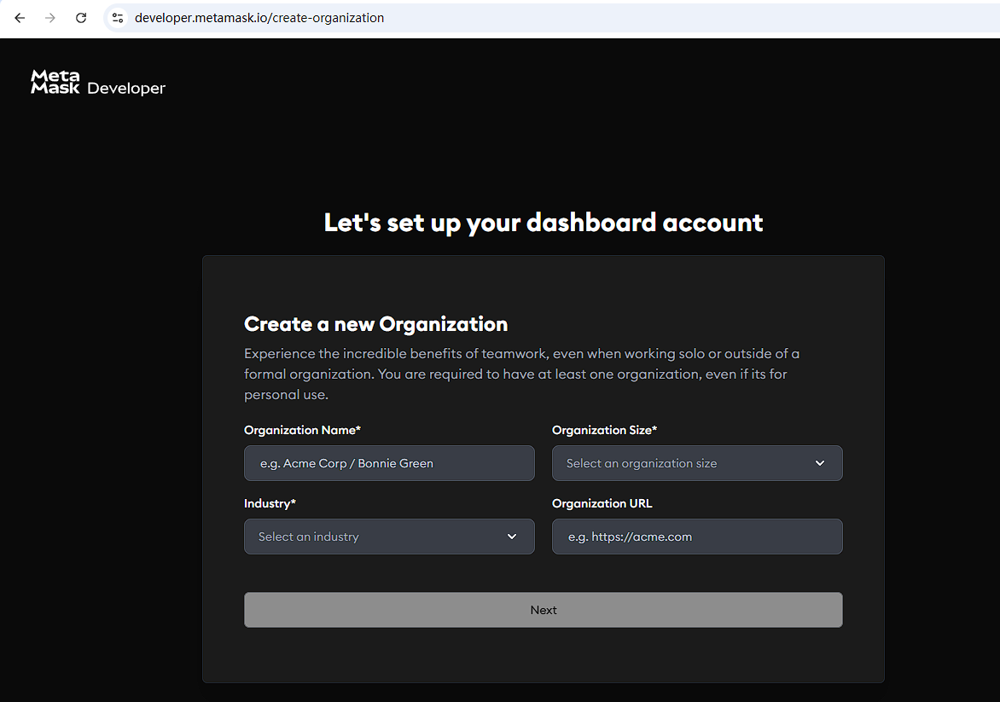

1.正常开发过程  lib目录的代码需要提交到git仓库吗

2.进行测试查看报错信息的详细信息时  使用forge test -vvvvv吗？在进行调试的时候  是在主合约方法内部console.log吗 需要导入哪个包？

3.进行测试的时候  是不是在test方法内部的block.timestamp和合约内部函数中使用到的block.timestamp是同一时间

4.在进行事件测试的时候  是不是需要先
vm.expectEmit(true, true, true, true);
然后再
// 验证事件被触发
emit AuctionCreated(0, seller, address(nft), TOKEN_ID, START_PRICE, block.timestamp, DURATION_HOURS);
最后再调用合约的方法进行事件验证？

5.写测试用例的时候得先vm.expectRevert("you are not the owner of this nft");才可以调用合约函数进行require验证？  
哪有那些操作是放在执行合约函数前面的 哪些操作是放在执行合约后面的？
```SOLIDITY
function test_SomeFunction() public {
    // ============ 阶段1: 准备 ============
    // 设置初始状态
    // - vm.deal, vm.prank, vm.warp
    // - 铸造代币、授权等准备操作
    
    // ============ 阶段2: 设置期望 ============
    // 如果是成功场景：
    // - vm.expectEmit (期望事件)
    // - 计算期望的返回值
    
    // 如果是失败场景：
    // - vm.expectRevert (期望错误)
    
    // ============ 阶段3: 执行 ============
    // - vm.prank (设置msg.sender)
    // - 调用合约函数
    
    // ============ 阶段4: 验证 ============
    // - assertEq, assertTrue 等断言
    // - 检查状态变化
    // - 检查返回值
}
```

6.真实开发的时候，是不是针对合约的每个方法的每个条件都得进行测试用例的编写，如果方法内部有10个require的条件  是不是至少得写10个test方法来针对每个情况进行测试？

7.amount的话，针对ETH单位是wei，针对ERC20呢？例如USDT那么单位就是1个代币么？总供应量是10000个代币，那么代币的精度和总供应量是什么关系？现实交易中总供应量等于是10000乘以精度吗？交易的时候也是用这个精度去交易的吗？

8.写测试用例的时候，遇到某个业务流程  是不是每个步骤都得写验证？还是只验证最后的步骤即可？例如test_EndAuction_Success_ETH，只需要验证最终是ETH结束的拍卖中，卖家有没有收到ETH，以及NFT是否转移到了buyer的账户下即可吧？

9.下面这个网站是干什么的


